``` r
#=========================================================#
# Load Software ####
#=========================================================#

library(spmodel)
library(ggplot2)
```

```
## Warning: package 'ggplot2' was built under R version 4.4.2
```

```
## RStudio Community is a great place to get help: https://community.rstudio.com/c/tidyverse
```

``` r
library(dplyr)
```

```
## Warning: package 'dplyr' was built under R version 4.4.1
```

```
## 
## Attaching package: 'dplyr'
```

```
## The following objects are masked from 'package:stats':
## 
##     filter, lag
```

```
## The following objects are masked from 'package:base':
## 
##     intersect, setdiff, setequal, union
```

``` r
library(emmeans)
```

```
## Warning: package 'emmeans' was built under R version 4.4.2
```

```
## Welcome to emmeans.
## Caution: You lose important information if you filter this package's results.
## See '? untidy'
```

``` r
#=========================================================#
# Section 3.1 Binary Data ####
#=========================================================#

head(moose)
```

```
## Simple feature collection with 6 features and 4 fields
## Geometry type: POINT
## Dimension:     XY
## Bounding box:  xmin: 281896.4 ymin: 1518398 xmax: 311325.3 ymax: 1541016
## Projected CRS: NAD83 / Alaska Albers
## # A tibble: 6 × 5
##    elev strat count presence           geometry
##   <dbl> <chr> <dbl> <fct>           <POINT [m]>
## 1  469. L         0 0        (293542.6 1541016)
## 2  362. L         0 0        (298313.1 1533972)
## 3  173. M         0 0        (281896.4 1532516)
## 4  280. L         0 0        (298651.3 1530264)
## 5  620. L         0 0        (311325.3 1527705)
## 6  164. M         0 0        (291421.5 1518398)
```

``` r
spbin <- spglm(
  formula = presence ~ elev + strat + elev:strat,
  family = binomial,
  data = moose,
  spcov_type = "spherical"
)

summary(spbin)
```

```
## 
## Call:
## spglm(formula = presence ~ elev + strat + elev:strat, family = binomial, 
##     data = moose, spcov_type = "spherical")
## 
## Deviance Residuals:
##     Min      1Q  Median      3Q     Max 
## -1.8423 -0.7538  0.3883  0.7604  1.6018 
## 
## Coefficients (fixed):
##              Estimate Std. Error z value Pr(>|z|)   
## (Intercept) -3.039992   1.205695  -2.521  0.01169 * 
## elev         0.009133   0.004126   2.213  0.02687 * 
## stratM       3.276511   1.162603   2.818  0.00483 **
## elev:stratM -0.010882   0.006697  -1.625  0.10418   
## ---
## Signif. codes:  0 '***' 0.001 '**' 0.01 '*' 0.05 '.' 0.1 ' ' 1
## 
## Pseudo R-squared: 0.08845
## 
## Coefficients (spherical spatial covariance):
##        de        ie     range 
## 5.083e+00 2.580e-03 5.158e+04 
## 
## Coefficients (Dispersion for binomial family):
## dispersion 
##          1
```

``` r
tidy(spbin)
```

```
## # A tibble: 4 × 5
##   term        estimate std.error statistic p.value
##   <chr>          <dbl>     <dbl>     <dbl>   <dbl>
## 1 (Intercept) -3.04      1.21        -2.52 0.0117 
## 2 elev         0.00913   0.00413      2.21 0.0269 
## 3 stratM       3.28      1.16         2.82 0.00483
## 4 elev:stratM -0.0109    0.00670     -1.62 0.104
```

``` r
moose$strat2 <- factor(moose$strat, levels = c("M", "L"))
update(spbin, formula = presence ~ elev + strat2 + elev:strat2) |>
  summary()
```

```
## 
## Call:
## spglm(formula = presence ~ elev + strat2 + elev:strat2, family = binomial, 
##     data = moose, spcov_type = "spherical")
## 
## Deviance Residuals:
##     Min      1Q  Median      3Q     Max 
## -1.8423 -0.7538  0.3883  0.7604  1.6018 
## 
## Coefficients (fixed):
##               Estimate Std. Error z value Pr(>|z|)   
## (Intercept)   0.236519   1.305198   0.181  0.85620   
## elev         -0.001750   0.006090  -0.287  0.77385   
## strat2L      -3.276511   1.162603  -2.818  0.00483 **
## elev:strat2L  0.010882   0.006697   1.625  0.10418   
## ---
## Signif. codes:  0 '***' 0.001 '**' 0.01 '*' 0.05 '.' 0.1 ' ' 1
## 
## Pseudo R-squared: 0.08845
## 
## Coefficients (spherical spatial covariance):
##        de        ie     range 
## 5.083e+00 2.580e-03 5.158e+04 
## 
## Coefficients (Dispersion for binomial family):
## dispersion 
##          1
```

``` r
emtrends(spbin, "strat", "elev")
```

```
##  strat elev.trend      SE  df asymp.LCL asymp.UCL
##  L        0.00913 0.00413 Inf   0.00105    0.0172
##  M       -0.00175 0.00609 Inf  -0.01369    0.0102
## 
## Degrees-of-freedom method: asymptotic 
## Confidence level used: 0.95
```

``` r
glance(spbin)
```

```
## # A tibble: 1 × 10
##       n     p  npar value   AIC  AICc   BIC logLik deviance pseudo.r.squared
##   <int> <dbl> <int> <dbl> <dbl> <dbl> <dbl>  <dbl>    <dbl>            <dbl>
## 1   218     4     3  681.  687.  687.  697.  -340.     161.           0.0885
```

``` r
head(augment(spbin))
```

```
## Simple feature collection with 6 features and 8 fields
## Geometry type: POINT
## Dimension:     XY
## Bounding box:  xmin: 281896.4 ymin: 1518398 xmax: 311325.3 ymax: 1541016
## Projected CRS: NAD83 / Alaska Albers
## # A tibble: 6 × 9
##   presence  elev strat .fitted .resid    .hat   .cooksd .std.resid           geometry
##   <fct>    <dbl> <chr>   <dbl>  <dbl>   <dbl>     <dbl>      <dbl>        <POINT [m]>
## 1 0         469. L      -1.47  -0.644 0.101   0.0130        -0.679 (293542.6 1541016)
## 2 0         362. L      -2.77  -0.349 0.0166  0.000523      -0.352 (298313.1 1533972)
## 3 0         173. M      -2.23  -0.451 0.00390 0.000200      -0.452 (281896.4 1532516)
## 4 0         280. L      -3.59  -0.234 0.00343 0.0000472     -0.234 (298651.3 1530264)
## 5 0         620. L      -0.774 -0.871 0.319   0.130         -1.06  (311325.3 1527705)
## 6 0         164. M      -2.01  -0.502 0.00459 0.000292      -0.503 (291421.5 1518398)
```

``` r
varcomp(spbin)
```

```
## # A tibble: 3 × 2
##   varcomp            proportion
##   <chr>                   <dbl>
## 1 Covariates (PR-sq)   0.0885  
## 2 de                   0.911   
## 3 ie                   0.000462
```

``` r
head(predict(spbin, newdata = moose_preds))
```

```
##           1           2           3           4           5           6 
##  0.08588581 -0.40762380 -1.87510889 -1.14172781  1.45701519 -2.74275553
```

``` r
head(augment(
  spbin,
  newdata = moose_preds,
  type.predict = "response",
  interval = "prediction"
))
```

```
## Simple feature collection with 6 features and 5 fields
## Geometry type: POINT
## Dimension:     XY
## Bounding box:  xmin: 291839.8 ymin: 1436192 xmax: 401239.6 ymax: 1512103
## Projected CRS: NAD83 / Alaska Albers
## # A tibble: 6 × 6
##    elev strat .fitted  .lower .upper           geometry
##   <dbl> <chr>   <dbl>   <dbl>  <dbl>        <POINT [m]>
## 1  143. L      0.521  0.0983   0.916 (401239.6 1436192)
## 2  324. L      0.399  0.0331   0.928 (352640.6 1490695)
## 3  158. L      0.133  0.00957  0.709 (360954.9 1491590)
## 4  221. M      0.242  0.0261   0.792 (291839.8 1466091)
## 5  209. M      0.811  0.289    0.978 (310991.9 1441630)
## 6  218. L      0.0605 0.00360  0.534 (304473.8 1512103)
```

``` r
# fit nonspatial model using spglm()
bin <- spglm(
  formula = presence ~ elev + strat + elev:strat,
  family = binomial,
  data = moose,
  spcov_type = "none"
)
# fit nonspatial model using glm()
bin_glm <- glm(
  formula = presence ~ elev + strat + elev:strat,
  family = binomial,
  data = moose
)
# compare fixed effect coefficients and standard errors up to four decimals
data.frame(
  est_none = coef(bin),
  est_glm = coef(bin_glm),
  se_none = sqrt(diag(vcov(bin))),
  se_glm = sqrt(diag(vcov(bin_glm)))
) |>
  apply(2, round, digits = 4)
```

```
##             est_none est_glm se_none se_glm
## (Intercept)  -0.5219 -0.5219  0.5082 0.5082
## elev          0.0002  0.0002  0.0024 0.0024
## stratM        1.0274  1.0274  0.7150 0.7150
## elev:stratM  -0.0013 -0.0013  0.0038 0.0038
```

``` r
glances(spbin, bin)
```

```
## # A tibble: 2 × 11
##   model     n     p  npar value   AIC  AICc   BIC logLik deviance pseudo.r.squared
##   <chr> <int> <dbl> <int> <dbl> <dbl> <dbl> <dbl>  <dbl>    <dbl>            <dbl>
## 1 spbin   218     4     3  681.  687.  687.  697.  -340.     161.           0.0885
## 2 bin     218     4     0  717.  717.  717.  717.  -359.     294.           0.0283
```

``` r
loocv(spbin) |>
  apply(2, round, digits = 4)
```

```
##    bias    MSPE   RMSPE 
## -0.0006  0.1458  0.3818
```

``` r
loocv(bin) |>
  apply(2, round, digits = 4)
```

```
##   bias   MSPE  RMSPE 
## 0.0000 0.2403 0.4902
```

``` r
AUROC(spbin)
```

```
## [1] 0.9490741
```

``` r
AUROC(bin)
```

```
## [1] 0.647138
```

``` r
## Figures ####

### Figure 1 ####
okabe <- c("#E69F00", "#56B4E9", "#009E73", "#F0E442", "#0072B2", "#D55E00", "#CC79A7")
moose_comb <- bind_rows(moose |> mutate(samp = "yes"), moose_preds |> mutate(samp = "no"))
ggplot(moose_comb, aes(color = presence, shape = samp)) +
  geom_sf(size = 2) +
  scale_color_manual(name = "moose", values = okabe[1:2], breaks = c(1, 0), labels = c("yes", "no")) +
  scale_shape_manual(name = "sampled", values = c(19, 17), breaks = c("yes", "no"), labels = c("yes", "no")) +
  theme_bw(base_size = 16) +
  scale_y_continuous(breaks = seq(62.6, 63.6, length.out = 5)) +
  scale_x_continuous(breaks = seq(-148.5, -146, length.out = 3)) +
  guides(
    color = guide_legend(order = 1),
    shape = guide_legend(order = 2)
  ) +
  geom_sf(size = 2, data = moose_comb %>% filter(samp == "no"), color = "red", shape = 17)
```

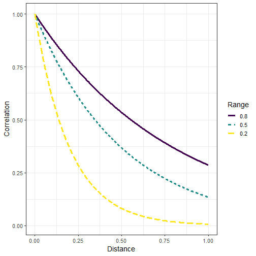

``` r
### Figure 2 ####
spbin_aug <- augment(spbin)

ggplot(spbin_aug, aes(color = .hat)) +
  geom_sf(size = 2) +
  scale_color_viridis_c(option = "E", name = ".hat") +
  scale_y_continuous(breaks = seq(62.6, 63.6, length.out = 5)) +
  scale_x_continuous(breaks = seq(-148.5, -146, length.out = 3)) +
  theme_bw(base_size = 14)
```

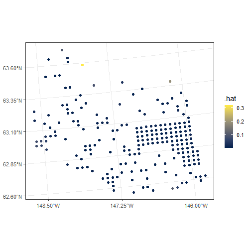

``` r
ggplot(spbin_aug, aes(color = .std.resid)) +
  geom_sf(size = 2) +
  scale_color_viridis_c(option = "A", limits = c(-2, 2)) +
  scale_y_continuous(breaks = seq(62.6, 63.6, length.out = 5)) +
  scale_x_continuous(breaks = seq(-148.5, -146, length.out = 3)) +
  theme_bw(base_size = 14)
```

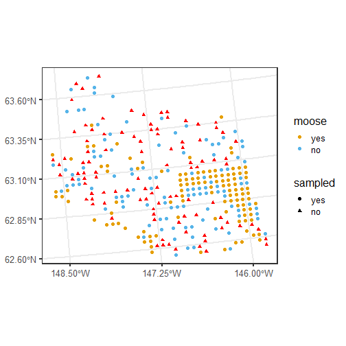

``` r
### Figure 3 ####
plot(spbin, which = 4)
```

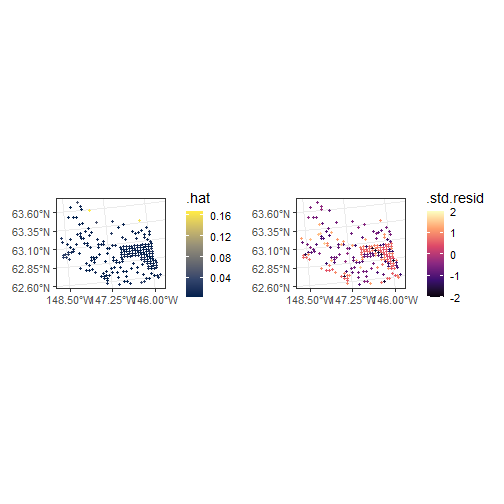

``` r
plot(spbin, which = 7)
```

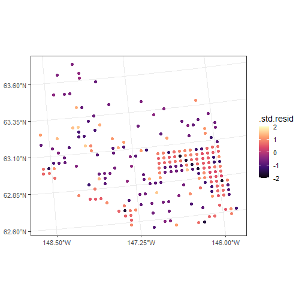

``` r
### Figure 4 ####
preds_aug <- augment(
  spbin,
  newdata = moose_preds,
  type.predict = "response",
  interval = "prediction"
)
spbin_aug <- augment(spbin, type.predict = "response", interval = "prediction")
comb_aug <- bind_rows(spbin_aug %>% mutate(Type = "Fitted"), preds_aug %>% mutate(Type = "Pred"))

ggplot(comb_aug, aes(color = .fitted, shape = Type)) +
  geom_sf(size = 2) +
  scale_color_viridis_c(option = "H", name = "Prob", limits = c(0, 1)) +
  scale_y_continuous(breaks = seq(62.6, 63.6, length.out = 5)) +
  scale_x_continuous(breaks = seq(-148.5, -146, length.out = 3)) +
  theme_bw()
```

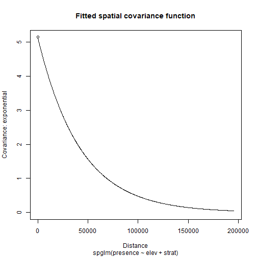

``` r
### Figure 5 ####

ggplot(preds_aug, aes(color = .lower)) +
  geom_sf(size = 2, pch = 17) +
  scale_color_viridis_c(option = "H", name = "Lower", limits = c(0, 1)) +
  scale_y_continuous(breaks = seq(62.6, 63.6, length.out = 5)) +
  scale_x_continuous(breaks = seq(-148.5, -146, length.out = 3)) +
  theme_bw(base_size = 14)
```

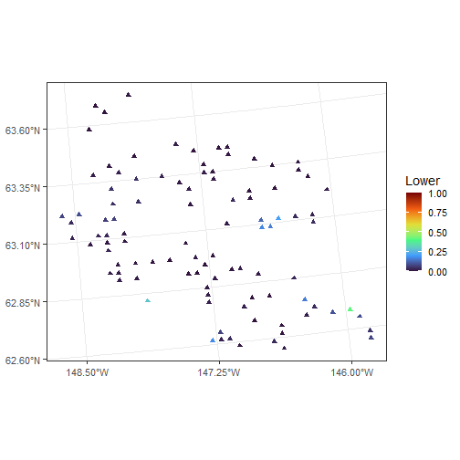

``` r
ggplot(preds_aug, aes(color = .upper)) +
  geom_sf(size = 2, pch = 17) +
  scale_color_viridis_c(option = "H", name = "Upper", limits = c(0, 1)) +
  scale_y_continuous(breaks = seq(62.6, 63.6, length.out = 5)) +
  scale_x_continuous(breaks = seq(-148.5, -146, length.out = 3)) +
  theme_bw(base_size = 14)
```

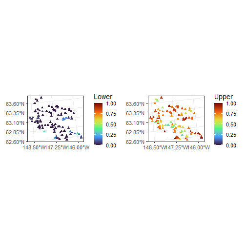

``` r
#=========================================================#
# Section 3.2 Count Data ####
#=========================================================#

sppois <- spglm(
  formula = count ~ elev + strat + elev:strat,
  family = poisson,
  data = moose,
  spcov_type = "gaussian",
  anisotropy = TRUE
)

spnbin <- update(sppois, family = nbinomial)

glances(sppois, spnbin, sort_by = "AIC") |>
  subset(select = c(model, npar, AIC, AICc, BIC))
```

```
## # A tibble: 2 × 5
##   model   npar   AIC  AICc   BIC
##   <chr>  <int> <dbl> <dbl> <dbl>
## 1 spnbin     6 1318. 1319. 1339.
## 2 sppois     5 1320. 1321. 1337.
```

``` r
loocv(sppois) |>
  apply(2, round, digits = 4)
```

```
##    bias    MSPE   RMSPE 
##  1.2882 31.7882  5.6381
```

``` r
loocv(spnbin) |>
  apply(2, round, digits = 4)
```

```
##    bias    MSPE   RMSPE 
##  0.3485 28.3760  5.3269
```

``` r
spnbin_iso <- update(spnbin, anisotropy = FALSE)
glances(spnbin_iso, spnbin, sort_by = "AIC") |>
  subset(select = c(model, npar, AIC, AICc, BIC))
```

```
## # A tibble: 2 × 5
##   model       npar   AIC  AICc   BIC
##   <chr>      <int> <dbl> <dbl> <dbl>
## 1 spnbin         6 1318. 1319. 1339.
## 2 spnbin_iso     4 1333. 1333. 1346.
```

``` r
tidy(spnbin, effects = "spcov")
```

```
## # A tibble: 5 × 3
##   term    estimate is_known
##   <chr>      <dbl> <lgl>   
## 1 de         4.65  FALSE   
## 2 ie         0.148 FALSE   
## 3 range  84013.    FALSE   
## 4 rotate     2.74  FALSE   
## 5 scale      0.259 FALSE
```

``` r
## Figures ####

### Figure 6 ####

ggplot(moose_comb, aes(color = count, shape = samp)) +
  geom_sf(size = 2) +
  scale_color_binned(breaks = c(0, 1, 2, 5, 10, 20, 40), type = "viridis") +
  scale_shape_manual(name = "sampled", values = c(19, 17), breaks = c("yes", "no"), labels = c("yes", "no")) +
  theme_bw(base_size = 14) +
  scale_y_continuous(breaks = seq(62.6, 63.6, length.out = 5)) +
  scale_x_continuous(breaks = seq(-148.5, -146, length.out = 3)) +
  geom_sf(size = 2, data = moose_comb %>% filter(samp == "no"), color = "red", shape = 17)
```


``` r
### Figure 7 ####

plot(spnbin_iso, which = 8)
```

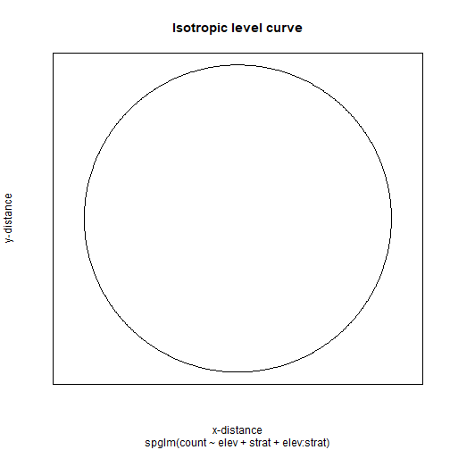

``` r
plot(spnbin, which = 8)
```

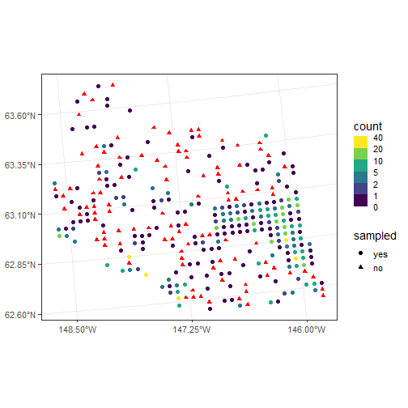

``` r
#=========================================================#
# Section 3.3 Skewed Data ####
#=========================================================#

seal$trend <- exp(seal$log_trend)

spgam <- spgautor(
  formula = trend ~ 1,
  family = Gamma,
  data = seal,
  spcov_type = "sar",
  random = ~ stock
)
spinvg <- update(spgam, family = inverse.gaussian)
glances(spgam, spinvg, sort_by = "AIC") |>
  subset(select = c(model, npar, AIC, AICc, BIC))
```

```
## # A tibble: 2 × 5
##   model   npar   AIC  AICc   BIC
##   <chr>  <int> <dbl> <dbl> <dbl>
## 1 spinvg     5  108.  109.  121.
## 2 spgam      5  114.  115.  127.
```

``` r
tidy(spinvg, effects = "randcov")
```

```
## # A tibble: 1 × 3
##   term      estimate is_known
##   <chr>        <dbl> <lgl>   
## 1 1 | stock  0.00411 FALSE
```

``` r
# output omitted in manuscript; head() used here
head(predict(spinvg, type = "response", interval = "prediction"))
```

```
##          fit       lwr       upr
## 1  0.9418666 0.8932676 0.9931095
## 9  0.9418691 0.8932697 0.9931126
## 13 0.9418684 0.8932692 0.9931117
## 15 0.9418689 0.8932696 0.9931122
## 18 0.9418681 0.8932687 0.9931116
## 19 0.9418687 0.8932693 0.9931122
```

``` r
head(augment(
  spinvg,
  newdata = spinvg$newdata,
  type.predict = "response",
  interval = "prediction"
))
```

```
## Simple feature collection with 6 features and 6 fields
## Geometry type: POLYGON
## Dimension:     XY
## Bounding box:  xmin: 1030504 ymin: 1012786 xmax: 1115097 ymax: 1057579
## Projected CRS: NAD83 / Alaska Albers
## # A tibble: 6 × 7
##   log_trend stock trend .fitted .lower .upper                                                                               geometry
##       <dbl> <fct> <dbl>   <dbl>  <dbl>  <dbl>                                                                          <POLYGON [m]>
## 1        NA 8        NA   0.942  0.893  0.993 ((1035002 1054710, 1035002 1054542, 1035002 1053542, 1035002 1052542, 1035002 1051624…
## 2        NA 8        NA   0.942  0.893  0.993 ((1043093 1020553, 1043097 1020550, 1043101 1020550, 1043166 1020557, 1043231 1020559…
## 3        NA 8        NA   0.942  0.893  0.993 ((1099737 1054310, 1099752 1054262, 1099788 1054278, 1099849 1054301, 1099912 1054320…
## 4        NA 8        NA   0.942  0.893  0.993 ((1099002 1036542, 1099134 1036462, 1099139 1036431, 1099145 1036366, 1099147 1036300…
## 5        NA 8        NA   0.942  0.893  0.993 ((1076902 1053189, 1076912 1053179, 1076931 1053179, 1076996 1053177, 1077002 1053176…
## 6        NA 8        NA   0.942  0.893  0.993 ((1070501 1046969, 1070317 1046598, 1070308 1046542, 1070306 1046534, 1070291 1046470…
```

``` r
## Figures ####

### Figure 8 ####

seal$sampled <- factor(if_else(is.na(seal$trend), "no", "yes"), levels = c("yes", "no"))
ggplot(seal, aes(fill = sampled, color = stock)) +
  geom_sf(size = 2) +
  theme_bw(base_size = 14) +
  scale_fill_manual(name = "sampled", values = okabe[1:2], breaks = c("yes", "no"), labels = c("yes", "no")) +
  scale_color_manual(name = "stock", values = c("grey40", "grey80"), breaks = c(8, 10), labels = c(8, 10)) +
  scale_y_continuous(breaks = seq(57, 59, length.out = 5)) +
  scale_x_continuous(breaks = seq(-139, -134, length.out = 3))
```

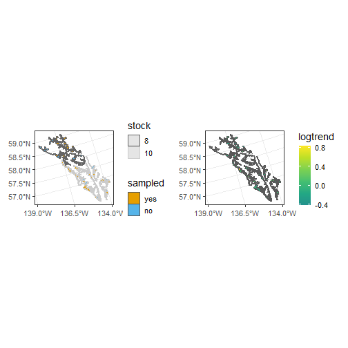

``` r
ggplot(seal, aes(fill = trend)) +
  geom_sf(size = 2) +
  theme_bw(base_size = 14) +
  scale_fill_viridis_c(option = "D", begin = 0.5, limits = c(0, max(seal$trend))) +
  scale_y_continuous(breaks = seq(57, 59, length.out = 5)) +
  scale_x_continuous(breaks = seq(-139, -134, length.out = 3))
```

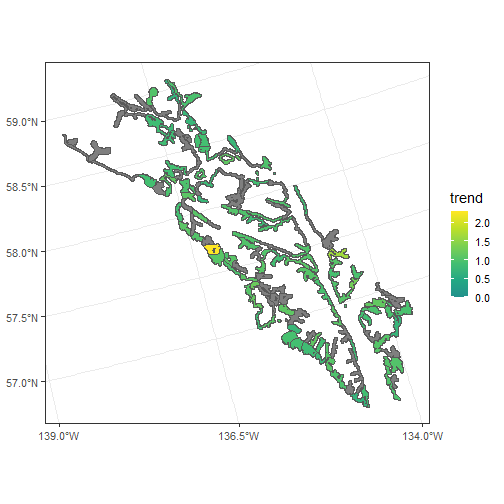

``` r
#=========================================================#
# Section 3.4 Proportion Data ####
#=========================================================#

spbeta <- spglm(
  formula = z/100 ~ water + tarp + water:tarp,
  family = "beta",
  data = caribou,
  spcov_type = "matern",
  xcoord = x,
  ycoord = y
)

tidy(anova(spbeta))
```

```
## # A tibble: 4 × 4
##   effects        df statistic       p.value
##   <chr>       <int>     <dbl>         <dbl>
## 1 (Intercept)     1  35783.   0            
## 2 water           1      1.52 0.218        
## 3 tarp            2     38.4  0.00000000468
## 4 water:tarp      2      5.74 0.0566
```

``` r
spemm <- emmeans(spbeta, ~ water + tarp)
spemm
```

```
##  water tarp  emmean     SE  df asymp.LCL asymp.UCL
##  N     clear  -3.94 0.0208 Inf     -3.98     -3.90
##  Y     clear  -3.90 0.0206 Inf     -3.94     -3.86
##  N     none   -3.88 0.0204 Inf     -3.92     -3.84
##  Y     none   -3.91 0.0206 Inf     -3.95     -3.87
##  N     shade  -3.77 0.0196 Inf     -3.81     -3.73
##  Y     shade  -3.83 0.0200 Inf     -3.87     -3.79
## 
## Degrees-of-freedom method: asymptotic 
## Results are given on the logit (not the response) scale. 
## Confidence level used: 0.95
```

``` r
update(spemm, type = "response")
```

```
##  water tarp  response       SE  df asymp.LCL asymp.UCL
##  N     clear   0.0191 0.000390 Inf    0.0183    0.0198
##  Y     clear   0.0198 0.000398 Inf    0.0190    0.0205
##  N     none    0.0202 0.000404 Inf    0.0194    0.0210
##  Y     none    0.0197 0.000398 Inf    0.0189    0.0205
##  N     shade   0.0226 0.000434 Inf    0.0218    0.0235
##  Y     shade   0.0213 0.000418 Inf    0.0205    0.0221
## 
## Degrees-of-freedom method: asymptotic 
## Confidence level used: 0.95 
## Intervals are back-transformed from the logit scale
```

``` r
head(pairs(spemm, adjust = "none"))
```

```
##  contrast          estimate     SE  df z.ratio p.value
##  N clear - Y clear  -0.0361 0.0293 Inf  -1.233  0.2177
##  N clear - N none   -0.0601 0.0292 Inf  -2.063  0.0391
##  N clear - Y none   -0.0327 0.0293 Inf  -1.118  0.2637
##  N clear - N shade  -0.1735 0.0286 Inf  -6.061  <.0001
##  N clear - Y shade  -0.1136 0.0289 Inf  -3.932  0.0001
##  Y clear - N none   -0.0241 0.0290 Inf  -0.830  0.4064
## 
## Degrees-of-freedom method: asymptotic 
## Results are given on the log odds ratio (not the response) scale.
```

``` r
spgautor_mods <- spgautor(
  formula = turnout ~ log_income,
  family = beta,
  data = texas,
  spcov_type = c("car", "sar"),
  cutoff = 2e5,
  estmethod = "ml"
)

glances(spgautor_mods) |>
  subset(select = c(model, npar, AIC, AICc, BIC))
```

```
## # A tibble: 2 × 5
##   model  npar   AIC  AICc   BIC
##   <chr> <int> <dbl> <dbl> <dbl>
## 1 car       3 -38.3 -38.1 -21.2
## 2 sar       3 -35.7 -35.5 -18.6
```

``` r
tidy(spgautor_mods$car)
```

```
## # A tibble: 2 × 5
##   term        estimate std.error statistic    p.value
##   <chr>          <dbl>     <dbl>     <dbl>      <dbl>
## 1 (Intercept)   -4.74      1.06      -4.47 0.00000783
## 2 log_income     0.532     0.117      4.55 0.00000531
```

``` r
reduced_car <- update(spgautor_mods$car, formula = turnout ~ 1)
tidy(anova(reduced_car, spgautor_mods$car))
```

```
## # A tibble: 1 × 5
##   full              reduced        df statistic     p.value
##   <chr>             <chr>       <dbl>     <dbl>       <dbl>
## 1 spgautor_mods$car reduced_car     1      24.1 0.000000930
```

``` r
## Figures ####

### Figure 9 ####

ggplot(caribou, aes(x = x, y = y, color = z, shape = tarp, size = water)) +
  geom_point() +
  scale_color_viridis_c(option = "H") +
  scale_size_discrete(range = c(2, 4)) +
  theme_bw(base_size = 14) +
  theme(
    legend.title = element_text(size = 12),
    legend.text = element_text(size = 12),
    legend.key.height = unit(0.03, 'npc')
  )
```

```
## Warning: Using size for a discrete variable is not advised.
```

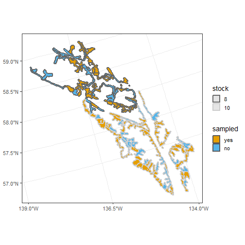

``` r
### Figure 10 ####

texas$samp <- factor(if_else(is.na(texas$turnout), "no", "yes"), levels = c("yes", "no"))
ggplot(texas, aes(color = turnout, shape = samp)) +
  geom_sf(size = 2) +
  scale_color_viridis_c(option = "D") +
  scale_shape_manual(name = "sampled", values = c(19, 17), breaks = c("yes", "no"), labels = c("yes", "no")) +
  theme_bw(base_size = 14) +
  scale_x_continuous(breaks = seq(-94, -106, length.out = 3)) +
  geom_sf(size = 2, data = texas %>% filter(samp == "no"), color = "red", shape = 17)
```

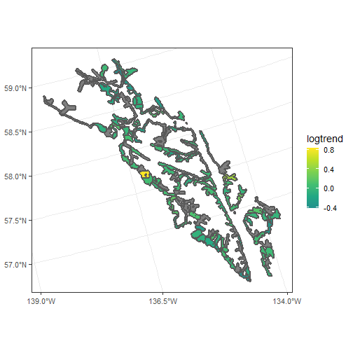

``` r
#=========================================================#
# Session Information ####
#=========================================================#

sessionInfo()
```

```
## R version 4.4.0 (2024-04-24 ucrt)
## Platform: x86_64-w64-mingw32/x64
## Running under: Windows 11 x64 (build 22621)
## 
## Matrix products: default
## 
## 
## locale:
## [1] LC_COLLATE=English_United States.utf8  LC_CTYPE=English_United States.utf8    LC_MONETARY=English_United States.utf8
## [4] LC_NUMERIC=C                           LC_TIME=English_United States.utf8    
## 
## time zone: America/Los_Angeles
## tzcode source: internal
## 
## attached base packages:
## [1] stats     graphics  grDevices utils     datasets  methods   base     
## 
## other attached packages:
## [1] emmeans_1.10.5 dplyr_1.1.4    ggplot2_3.5.1  spmodel_0.10.0
## 
## loaded via a namespace (and not attached):
##  [1] Matrix_1.7-0       gtable_0.3.5       compiler_4.4.0     tidyselect_1.2.1   Rcpp_1.0.12        parallel_4.4.0    
##  [7] scales_1.3.0       lattice_0.22-6     here_1.0.1         coda_0.19-4.1      plyr_1.8.9         R6_2.5.1          
## [13] labeling_0.4.3     generics_0.1.3     classInt_0.4-10    sf_1.0-19          knitr_1.48         tibble_3.2.1      
## [19] pROC_1.18.5        units_0.8-5        munsell_0.5.1      rprojroot_2.0.4    DBI_1.2.3          pillar_1.9.0      
## [25] rlang_1.1.4        utf8_1.2.4         xfun_0.47          viridisLite_0.4.2  estimability_1.5.1 cli_3.6.3         
## [31] withr_3.0.1        magrittr_2.0.3     class_7.3-22       grid_4.4.0         rstudioapi_0.16.0  mvtnorm_1.2-5     
## [37] xtable_1.8-4       lifecycle_1.0.4    vctrs_0.6.5        KernSmooth_2.23-22 proxy_0.4-27       evaluate_0.24.0   
## [43] glue_1.7.0         farver_2.1.2       colorspace_2.1-0   fansi_1.0.6        e1071_1.7-14       tools_4.4.0       
## [49] pkgconfig_2.0.3
```

``` r
# R code spun into .md and .html using knitr::spin(code.R)
```

